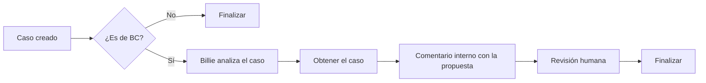

Parece que nuestro nuevo compañero aprende rápido. En el [artículo anterior](https://danielzafon.github.io/mi-bc-copilot-blog/posts/billie-agente-analisis-casos-soporte-foundry-ai-search/) te presenté a **Billie**, el agente que analiza incidencias de Business Central a partir de nuestro histórico de casos. En pocos días ha aprendido algo nuevo: escribir un comentario interno con la solución que propone en cada caso de nuestra plataforma de soporte (Customer Service, que para algo somos partners de Microsoft 😉). Así, el técnico la tiene a mano para revisarla al coger el caso.

Por el camino, Billie también ha cambiado de casa: ha pasado de ser un agente de Microsoft Foundry a ser un agente de **Copilot Studio**.

## Por qué el cambio a Copilot Studio

Tenía dos motivos:

- **Explorar los [flujos agénticos de Copilot Studio](https://learn.microsoft.com/es-es/microsoft-copilot-studio/flows-overview)**, una funcionalidad muy reciente. Quería ver qué se puede montar con ellos en un escenario real de soporte.
- **Comparar costes.** En Azure el agente funciona con pago por uso; en Copilot Studio, con créditos. Tener el mismo agente en ambas plataformas es la forma más fiable de comparar con datos propios cuánto cuesta el mismo volumen de análisis.

Pero el cambio de fondo no es de plataforma, sino de modelo de uso. Hasta ahora el técnico tenía que acordarse de preguntar a Billie. El objetivo ahora es que el agente se ejecute **de forma autónoma cuando el cliente crea un caso**, sin que nadie tenga que pedírselo.

## El agente en Copilot Studio

El agente, *Billie - Agente soporte BC*, mantiene la misma filosofía que la versión de Foundry: las instrucciones conservan el recordatorio operativo (checklist inicial y validación tras cada búsqueda), el objetivo y las reglas obligatorias, empezando por la de no inventar causas ni resoluciones.

{: w="1800" h="905" .shadow }
*Billie en Copilot Studio: instrucciones, modelo Claude Sonnet 4.6 y la herramienta de búsqueda híbrida semántica.*

Lo que cambia (y lo que no) respecto a la versión de Foundry:

- El modelo seleccionado es **Claude Sonnet 4.6**.
- La base de conocimiento sigue estando en Azure AI Search, conectada como herramienta (**Búsqueda híbrida semántica**) sobre el índice `indice-casos-bc`.
- He tenido que añadir una regla específica para la llamada de búsqueda: usar siempre los parámetros básicos, **sin** `selectFields` ni `semanticConfiguration`.

```json
{
  "searchText": "asiento regularización cierre cuenta ganancias retenidas...",
  "nearestNeighbors": 5,
  "top": 5
}
```

> Si conectas Azure AI Search como herramienta y las búsquedas no devuelven lo que esperas, revisa qué parámetros está generando el agente en la llamada. Fijar en las instrucciones la forma exacta de la consulta, con un ejemplo, es una manera sencilla de acotar su comportamiento.
{: .prompt-tip }

## El flujo agéntico

El flujo de trabajo, *Billie - Análisis de casos BC*, lo he creado y publicado desde la sección **Flujos de trabajo** de Copilot Studio.

{: w="1817" h="902" .shadow }
*El flujo publicado y habilitado.*

Su recorrido actual es este:

1. El cliente crea un caso en nuestra plataforma de soporte.
2. Salta el desencadenante y el flujo comprueba si es un caso de Business Central. Si no lo es, finaliza: de momento no vamos a incorporar un agente similar para el resto de departamentos.
3. Si es un caso de BC, se llama a Billie para que lo analice.
4. Con el análisis hecho, se inserta un **comentario interno** en el caso con la propuesta de Billie, para que la revise el técnico al cogerlo.



### El desencadenante

El flujo arranca con el desencadenante de Dataverse **Cuando se agrega, modifica o elimina una fila**, configurado sobre la tabla **Casos** con ámbito **Organization**. Solo selecciono las columnas que necesito: `responsiblecontactid`, `title` y `ticketnumber`.

{: w="1416" h="820" .shadow }
*Desencadenante de Dataverse sobre la tabla Casos.*

> Como pasa con muchas funcionalidades recién lanzadas, el desencadenante no funciona del todo bien, al menos en mi caso. Si configuro el tipo de cambio solo como **Crear**, el flujo no llega a saltar nunca. Con **Crear o actualizar**, normalmente solo salta al crear el caso, aunque en alguna ocasión lo ha hecho dos veces. Ahora mismo es el menor de mis problemas, pero tenlo en cuenta si montas algo parecido: puedes encontrarte algún caso con el análisis duplicado.
{: .prompt-warning }

Después, un nodo **If/Else** decide si el caso es de Business Central. La rama *Si no* termina en *Finalizar - No es BC*.

### El comentario interno

Tras la llamada al agente y la lectura del caso (**Obtener una fila por id**), el nodo **Agregar una fila nueva** crea un registro en la tabla **Comentarios internos**. En la **Descripción** va el resultado del agente (`Result`).

{: w="1844" h="864" .shadow }
*El análisis de Billie se guarda como comentario interno del caso.*

Este es el punto que cambia el día a día: cuando el técnico abre el caso, la propuesta ya está ahí. No tiene que copiar el título y la descripción en otra herramienta para pasárselos a Billie.

## La revisión humana: la pieza que falta

El resto del flujo incluye una **revisión humana**. El nodo *Human review* envía por Outlook a las personas asignadas un mensaje con el número y el título del caso y la propuesta del agente, y les pregunta si la solución es válida (sí o no).

{: w="1864" h="876" .shadow }
*Revisión humana: el equipo valida si la solución propuesta es correcta.*

Lo que **todavía no está implementado** es lo que viene después: que esas respuestas del equipo sirvan para ir alimentando la base de conocimiento (el servicio de Azure AI Search) con nuevos casos, problemas y soluciones. Más abajo te cuento cómo me lo planteo.

## Impacto práctico

- **El análisis llega antes que el técnico.** El primer cribado está hecho cuando alguien coge el caso.
- **Nadie tiene que acordarse de usar el agente.** La adopción deja de depender de un hábito individual.
- **La validación humana sigue en el centro.** Billie propone en un comentario interno; quien decide qué se responde al cliente es el técnico.

## Hacia dónde puede evolucionar Billie

Con el flujo en marcha, hay dos líneas que me interesan especialmente. Y el orden importa: la primera es la que da los datos para decidir sobre la segunda.

### 1. Alimentar la base de conocimiento con cada caso resuelto

Preparar la base de conocimiento ha sido, con diferencia, lo que más me ha costado, en tiempo y, sobre todo, en tokens. Pero Billie ya hace algo muy parecido en cada caso: identifica problema, causa y posible solución. La idea es aprovechar ese trabajo.

El matiz importante es **cuándo** capturar el conocimiento. La propuesta que hace Billie al crearse el caso es una hipótesis; la solución real solo se conoce cuando el caso se cierra. Por eso me planteo un circuito así:

1. **Al resolver o cerrar el caso**, otro flujo pasa el caso completo, con sus comentarios, por la misma normalización que hice en la carga inicial: problema, causa y solución. Hecho caso a caso, y solo con los resueltos, el coste debería ser mucho menor que el de la carga masiva.
2. **La respuesta sí/no del equipo se aprovecha como etiqueta.** Si la propuesta era válida, el caso es un candidato casi listo. Si no lo era, es justo el más valioso, porque señala un hueco que la base de conocimiento no cubría.
3. **Los candidatos van a una zona intermedia**, por ejemplo una tabla de Dataverse o ficheros JSON en Blob Storage, y no directamente al índice.
4. **Una persona los aprueba (o los corrige)** y solo entonces se incorporan al índice de Azure AI Search.
5. **Antes de insertar, se buscan duplicados.** Si ya existe un caso equivalente, es mejor reforzarlo (añadiendo la referencia del nuevo caso) que crear otro. Así, además, la regla de confianza «varios casos coinciden» se apoya en datos reales.

Añadiría también metadatos como la fecha, el producto, la versión de BC, el origen (histórico o agente) y quién lo validó. Servirían para filtrar y para retirar soluciones que una actualización de BC deje obsoletas. Este mismo circuito serviría, además, para recuperar poco a poco los casos que excluí en la carga inicial.

> Al índice solo debe entrar lo validado por una persona. Si las propuestas del agente se incorporan sin revisar, cualquier error suyo se convierte en «evidencia» para el siguiente caso, y el agente acaba reforzando sus propios fallos.
{: .prompt-danger }

### 2. Responder directamente al cliente

Si, después de un tiempo revisando respuestas, el equipo comprueba que las propuestas con confianza **Alta** suelen ser válidas, podemos plantearnos que, en esos casos, Billie responda directamente al cliente, avisando siempre de que la respuesta la ha generado una IA.

Antes de dar ese paso, tengo claras algunas condiciones:

- **Medir antes de decidir.** Con el sí/no del equipo se puede calcular qué porcentaje de propuestas con confianza Alta son válidas, por categoría. El umbral y el volumen mínimo de casos hay que fijarlos antes de ver los datos, no después.
- **No fiarlo todo a la confianza que declara el modelo.** Un LLM no está bien calibrado para valorar su propia certeza. Conviene combinarla con señales objetivas, como el número de casos similares encontrados y si coinciden en la solución.
- **Avanzar por fases.** Primero, comentario interno (lo que hay hoy). Después, un borrador de respuesta que el técnico envía con un clic, editándolo si hace falta. Y solo al final, envío automático en categorías de bajo riesgo, como Formación o Configuración, dejando fuera Datos, Desarrollo, Integración o cualquier tema fiscal.
- **No exponer datos de otros clientes.** El comentario interno cita casos similares; una respuesta al cliente no puede incluir esas referencias ni nada que identifique a otro cliente. Tiene que ser una regla explícita en las instrucciones.
- **Transparencia y salida a una persona.** Además del aviso de que es una respuesta generada por IA, el cliente debe poder indicar que no le resuelve el problema y llegar a un técnico. El caso no se cierra automáticamente: queda pendiente de confirmación y con un técnico responsable.
- **Vigilar lo que ya está automatizado.** Revisar la tasa de casos reabiertos tras una respuesta automática, auditar una muestra periódicamente y tener un interruptor para desactivarlo al momento.

Las dos líneas se retroalimentan: cuanto mejor sea la base de conocimiento, más casos tendrán confianza Alta con evidencia real, y antes tendrá sentido que Billie hable directamente con el cliente.

## Conclusión

Pasar de un agente al que hay que preguntar a uno que actúa solo cuando entra un caso es un salto pequeño en configuración y grande en uso real. Si estás montando algo parecido, te recomiendo que empieces igual: un ámbito acotado (solo casos de BC), una salida que no llegue directamente al cliente (un comentario interno) y una revisión humana que, con el tiempo, sirva también para mejorar la base de conocimiento. La respuesta directa al cliente puede llegar, pero solo cuando los datos lo justifiquen.

Me queda pendiente la comparativa de costes entre Foundry y Copilot Studio, que te contaré cuando tenga datos suficientes.

Seguramente haya otras formas de hacerlo, y probablemente mejores. Yo estoy explorando esta y te la comparto por si te puede ayudar.

## Enlaces de interés

- [Información general de los flujos de agente en Copilot Studio](https://learn.microsoft.com/es-es/microsoft-copilot-studio/flows-overview)
